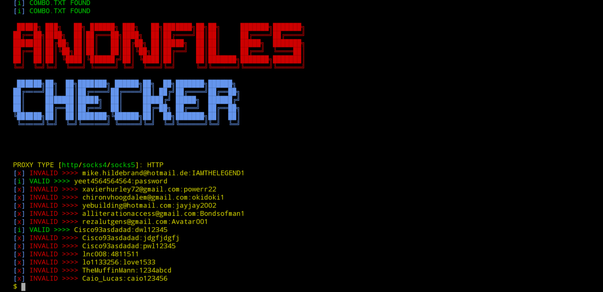

# Python Anonfiles Account Checker


<br />

## Table of contents
* [General info](#general-info)
* [Releases](#releases)
* [Installation](#installation)
* [Installation in Termux](#installation-in-termux)
* [Usage](#usage)
* [Disclaimer](#disclaimer)
* [Credits](#credits)
<br />


## General info
Anonfile_checker is a simple python script to check a Combo for working anonfiles.com Accounts.<br />
Is has a implemented proxy usage and saves the hits to a hits.txt file.
<br />

	
## Releases
**Anonfile Checker v0.5**
* Added main Checker on github
* Completed main Code
* Checker is kinda running stable
<br />

	
## Installation
To install this checker, simply copy & paste the following Code into your terminal:

```
$ git clone https://github.com/DeepWaterLeaks/anonfile_checker.git

$ cd anonfile_checker

$ pip3 install -r requirements.txt
```
<br />

## Installation in Termux
```
$ git clone https://github.com/DeepWaterLeaks/anonfile_checker.git

$ cd anonfile_checker

$ pip install colorma

$ pip install requests

$ pip install bs4

$ pkg install clang && pkg install libxml2 libxslt && pkg install libxml2 libxslt && pip install cython && pip install lxml
```
<br />

## Usage
To start the checker, go into its directory and type:
```
$ python anonfile_checker.py
```

Then you get asked what kind of proxys you put into the proxys.txt<br />
Enter HTTP if its http/https, SOCKS4 if its socks4 and SOCKS5 if its socks5
<br />
Then the Checker starts working
<br />
<br />

## Disclaimer
  * Use this tool for educational purposes only.
  * If you do any illegal attacks, i am not responsible for your tasks.
  * Use this tool correctly, and do not re-upload it on your github repository without permissions.
  <br />


# Credits
This Checker was made by DeepWaterLeaks and TheMasterCH
<br />
 _Channels :_ 

* [Deepwaterleaks](https://t.me/deepwaterleaks2)

* [LeakerHounds](https://t.me/LeakerHounds)

* [ViperZCrew](https://t.me/ViperZCrew)
         


